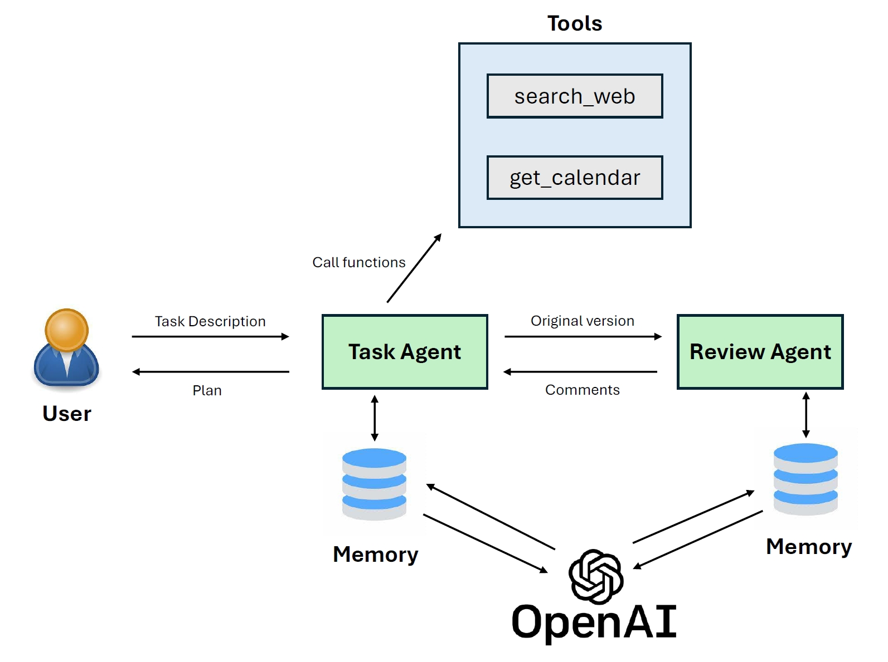

# Task Agent
Homework of FY25 APRD AI School China.

Task Agent is designed to streamline your development workflow by automating the task breakdown and scheduling process. Here's what it does:

- Task Input: Users provide the development tasks they need to complete.
- Automated Research: The agent automatically searches for relevant background knowledge related to the tasks.
- Task Decomposition: It breaks down the main tasks into smaller, manageable subtasks.
- Work Plan Generation: Taking into account upcoming holidays and other schedule constraints, the agent outputs a detailed work plan.

With this agent, you can ensure a more organized and efficient approach to managing your development projects.

## Architecture



## Usage

### Install requirements
```
pip install -r requirements.txt
```

### Fill in Configuration

Fill in the configuration in `env_template.py`.

```python
# Task Description
TASK_DESCRIPTION = "I need to support a new annotation for my ingress controller. This annotation is for jwt validation. "

# Azure Open AI
ENDPOINT_URL = ""
DEPLOYMENT_NAME = ""
AOAI_API_KEY = ""

# Bing Search
BING_SEARCH_V7_SUBSCRIPTION_KEY = ""
BING_ENDPOINT = ""

# Calendarific API
CALENDARIFIC_API_KEY = ""
CALENDARIFIC_URL = "https://calendarific.com/api/v2/holidays"
YEAR = 2024
COUNTRY = "CN"  
```
Rename the file to `env.py` and copy it to the `src` folder.
```bash
cp env_template.py src/eny.py
```

### Run

```bash
py src/main.py
```

Output will be like:
```
assistant: Thank you for your feedback. Based on your comments, here is the revised plan for adding JWT validation annotation to the ingress controller:

1. Research and Familiarize:
   - Estimated Time: 2 days
   - Daily Task Assignment:
     - Day 1 (October 8th, 2024): Research how JWT authentication works and its benefits for an ingress controller.
     - Day 2 (October 9th, 2024): Understand the existing ingress controller implementation and its configuration options.

2. Identify Requirements:
   - Estimated Time: 1 day
   - Daily Task Assignment:
     - Day 3 (October 10th, 2024): Determine the specific requirements for adding JWT validation to the ingress controller. Define the desired behavior and configuration options for the annotation.

3. Design and Architecture:
   - Estimated Time: 3 days
   - Daily Task Assignment:
     - Day 4 (October 11th, 2024): Design the high-level architecture for integrating JWT validation into the ingress controller.
     - Day 5 (October 14th, 2024): Determine the components and libraries required for implementing the annotation.
     - Day 6 (October 15th, 2024): Finalize the architectural design.

4. Implementation:
   - Estimated Time: 5 days
   - Daily Task Assignment:
     - Day 7 (October 16th, 2024): Modify the ingress controller codebase to support the new annotation.
     - Day 8-11 (October 17th-20th, 2024): Implement the necessary logic to validate the JWT tokens and integrate any required libraries or dependencies.
     - Day 12 (October 21st, 2024): Perform initial testing and bug fixing.

5. Testing:
   - Estimated Time: 3 days
   - Daily Task Assignment:
     - Day 13-15 (October 22nd-24th, 2024): Develop a comprehensive test suite and perform unit tests, integration tests, and end-to-end tests. Include negative test cases to ensure proper error handling.

6. Documentation:
   - Estimated Time: 2 days
   - Daily Task Assignment:
     - Day 16 (October 25th, 2024): Document the usage and configuration of the new annotation.
     - Day 17 (October 28th, 2024): Update any relevant documentation or user guides.

7. Review and Quality Assurance:
   - Estimated Time: 2 days
   - Daily Task Assignment:
     - Day 18 (October 29th, 2024): Conduct code reviews and address any feedback or improvements.
     - Day 19 (October 30th, 2024): Perform thorough testing and bug fixing.

8. Deployment and Rollout:
   - Estimated Time: 1 day
   - Daily Task Assignment:
     - Day 20 (October 31st, 2024): Plan and execute the deployment strategy for the updated ingress controller.

9. Documentation and Knowledge Sharing:
   - Estimated Time: 1 day
   - Daily Task Assignment:
     - Day 21 (November 1st, 2024): Update the documentation with any changes or lessons learned during the implementation process. Share knowledge and insights gained from the project with the team or community.

10. Support and Maintenance:
    - Estimated Time: Ongoing
    - Daily Task Assignment:
      - Day 22 onwards: Provide ongoing support for the ingress controller and the JWT validation annotation. Address any reported issues or bugs. Stay up-to-date with new releases and security updates related to the ingress controller and JWT authentication.

Please note that the estimated time for each task is provided as a specific day, and the daily task assignments are aligned with working days. Additionally, it is recommended to allocate some contingency time in the plan to account for unexpected issues or delays. Lastly, ensure to assign specific team members or roles to each task for clear accountability and responsibility.
```